# Majistar Product Labels for Magento 2 and Mage-OS

[](https://github.com/magento/magento2)
[](https://mage-os.org)
[](https://www.hyva.io)
[](https://www.php.net)
[](LICENSE)

Badges such as "Sale -20%", "New" or "Best seller" on top of product images. A label is a short text or an image of
your own. It is assigned by rules (categories, attributes, price, discount, stock, news dates) or by hand, and it
shows up on the product page, in category and search listings, in the cart, the mini-cart and the checkout summary.
The storefront part is written for [Hyvä](https://www.hyva.io).

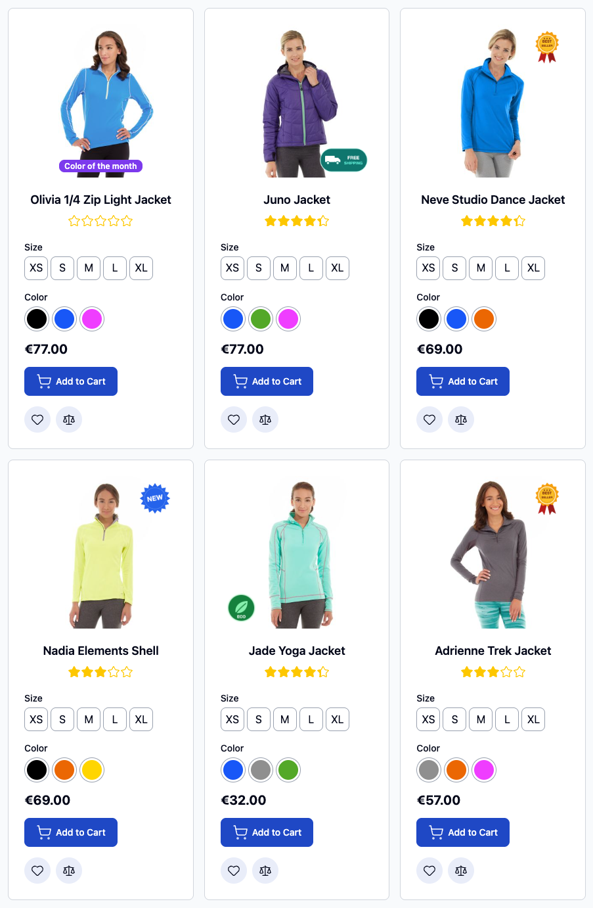

The screenshots come from a test store with the Luma sample catalog, set to show one label per product.

## Contents

- [Features](#features)
- [Requirements](#requirements)
- [Installation](#installation)
- [Configuration](#configuration)
- [Creating a label](#creating-a-label)
- [Configurable products](#configurable-products)
- [On the storefront](#on-the-storefront)
- [Indexing and caching](#indexing-and-caching)
- [REST API](#rest-api)
- [Extending](#extending)
- [Development](#development)
- [Uninstalling](#uninstalling)
- [License](#license)

## Features

- **Text or image labels.** Text labels have a background and a text color, three shapes (rectangle, pill,
  circle), three sizes and an adjustable corner radius. Image labels take a JPG, PNG, GIF, WebP or AVIF file and a
  width relative to the product image.
- **Nine positions** on the image. Labels in the same position are stacked, not drawn on top of each other.
- **A different look per place.** One appearance for the product page, one for listings and one for the cart,
  mini-cart and checkout. Each falls back to the previous one, so you only fill in what differs.
- **Variables in the text:** `{SAVE_PERCENT}`, `{SAVE_AMOUNT}`, `{PRICE}`, `{SPECIAL_PRICE}`, `{STOCK_QTY}`, `{SKU}`
  and `{ATTR:code}` for any product attribute.
- **Rules:** categories (anchor categories include their subcategories), attribute conditions with the builder of
  Catalog Price Rules, a price range, products on sale with an optional minimum discount, new products, and stock
  status (in stock, out of stock, or low stock below a quantity).
- **Who and when:** store views, customer groups, active from/to dates, priority, "stop further labels" and a
  maximum number of labels per product.
- **Manual assignment** from the product edit page.
- **Configurable products:** "Use for Parent" shows a variant's label on its configurable product, and the labels
  follow the variant the customer picks. The cart shows the labels of the variant that was bought.
- **Light on the storefront:** rules are evaluated by an indexer; prices, dates, stock and customer group are
  checked when the page is rendered, once for all its products. Cached pages are refreshed when a label is saved.
- **REST and SOAP API** with asynchronous bulk requests, image upload as base64, and the labels of a product as an
  extension attribute of the product API.
- English and Italian admin.

## Requirements

- Magento Open Source 2.4.7 or later, or Mage-OS 1.0 or later (developed and tested on Mage-OS 3.5). Adobe Commerce
  is not supported, because content staging changes how product ids are stored.
- PHP 8.2, 8.3 or 8.4.
- Hyvä Theme 1.5 or later (tested with 1.5.2). The admin works with any theme, but badges are only drawn by Hyvä
  templates; Luma is not supported.
- The Multi-Source Inventory modules (installed by default): stock checks read the MSI stock index.

## Installation

```bash
composer require majistar/module-product-labels
bin/magento module:enable Majistar_ProductLabels
bin/magento setup:upgrade
```

If the package is not on Packagist yet, add the repository first:

```bash
composer config repositories.majistar-product-labels vcs https://github.com/herjon/module-product-labels
```

The module adds its templates to the Tailwind build of your Hyvä theme. Regenerate the Hyvä configuration and
rebuild the theme styles:

```bash
bin/magento hyva:config:generate
npm --prefix app/design/frontend/<Vendor>/<theme>/web/tailwind run build
```

In production mode, finish with `bin/magento setup:di:compile` and `bin/magento setup:static-content:deploy`.
Without Composer, copy the files to `app/code/Majistar/ProductLabels` and run the same commands from
`module:enable` on.

## Configuration

**Stores > Configuration > Catalog > Catalog > Product Labels**

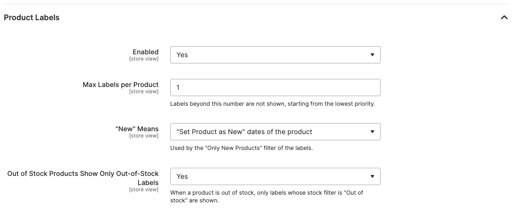

| Setting | Default | What it does |
| --- | --- | --- |
| Enabled | Yes | Turns the labels off on the storefront without touching them. |
| Max Labels per Product | 2 | Extra labels are dropped, lowest priority first. |
| "New" Means | "Set Product as New" dates | What the "Only New Products" filter looks at: the "Set Product as New" dates, or the days since the product was created. |
| New for (Days) | 30 | Used with "days since the product was created". |
| Out of Stock Products Show Only Out-of-Stock Labels | Yes | An out-of-stock product only shows labels whose stock filter is "Out of stock". |

## Creating a label

Labels live under **Catalog > Inventory > Product Labels**.

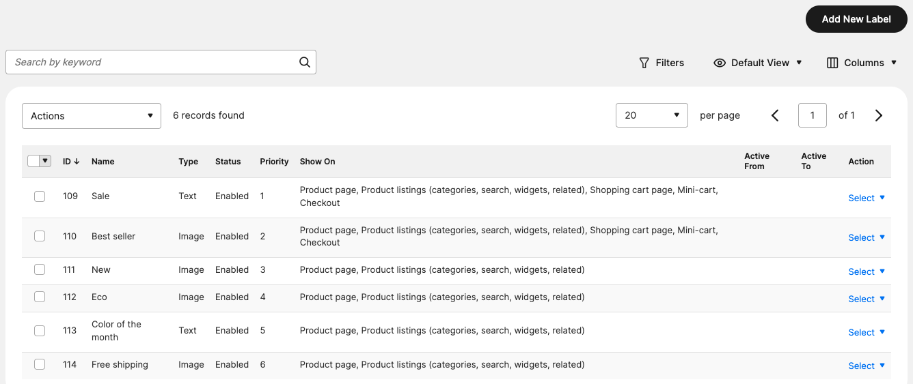

**General.** The name is only for the admin. Store views, customer groups and the active dates decide where and
when the label applies. Lower priorities are shown first; "Stop Further Labels" hides the labels that come after
this one. "Show On" picks the places: product page, product listings (categories, search, widgets, related
products), shopping cart page, mini-cart and checkout.

<details>
<summary>Screenshot: General</summary>

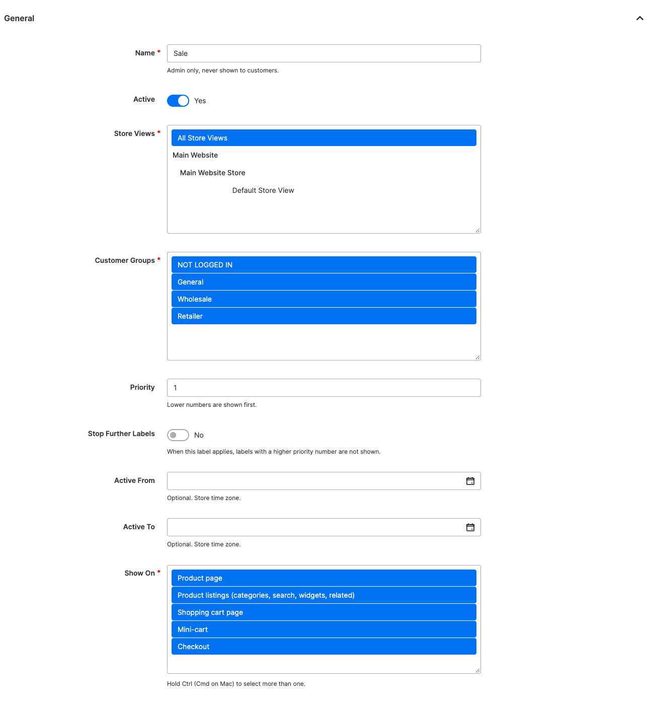

</details>

**Appearance on Product Page.** Text or image, colors, shape, size, corner radius and position. The variable menu
inserts `{SAVE_PERCENT}` and the other variables into the text.

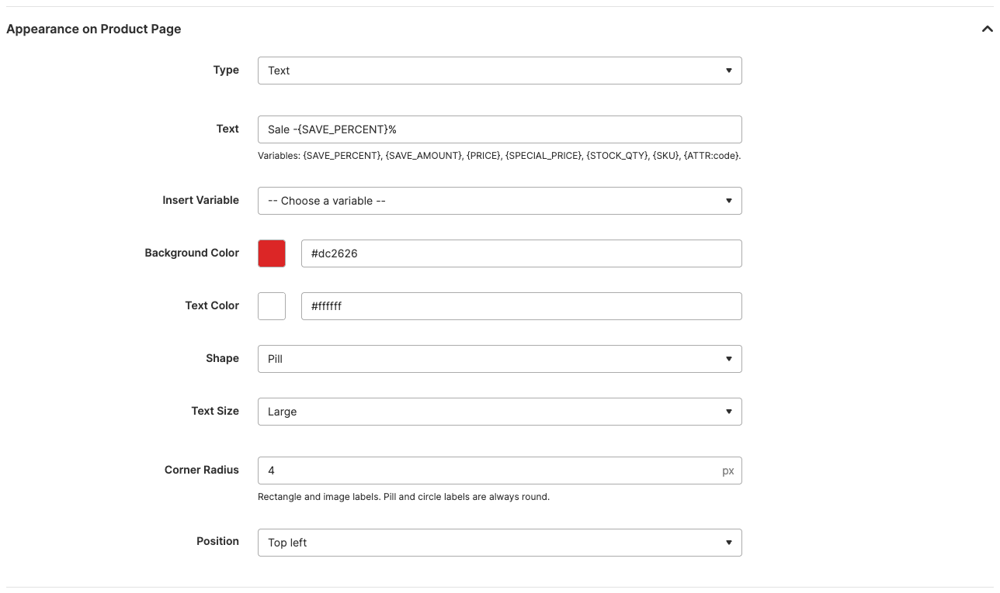

**Appearance in Product Listings** and **Appearance in Cart, Mini-cart and Checkout** reuse the previous appearance
until you switch them to their own, for example a smaller text for the cart thumbnails.

**Which Products.** Quick filters: only new products, only products on sale (optionally with a minimum discount),
stock, categories and a price range. All the filters you set must match.

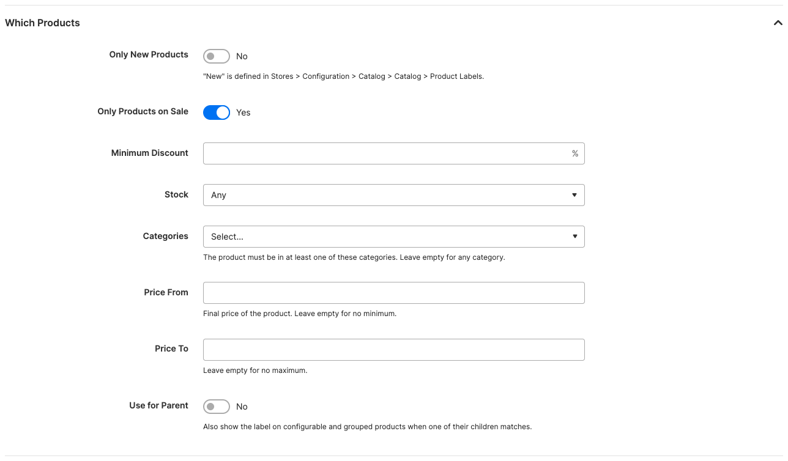

**Advanced Conditions.** The condition builder of Catalog Price Rules, for example "Eco Collection is Yes".

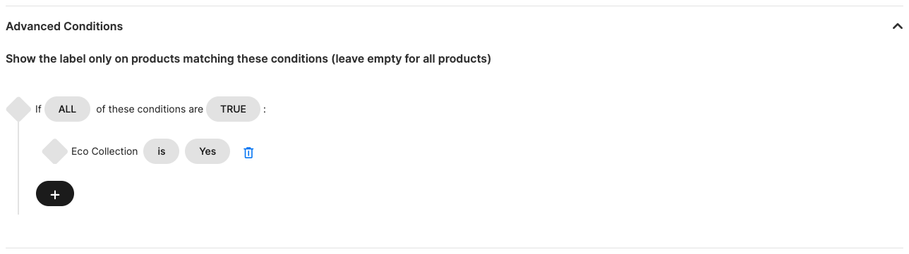

**Manually Assigned Products.** Labels can also be given by hand on the product edit page, in the **Product
Labels** section. A label assigned by hand is shown even when the product doesn't match its filters and conditions;
the active dates, store views, customer groups and "Show On" still apply.

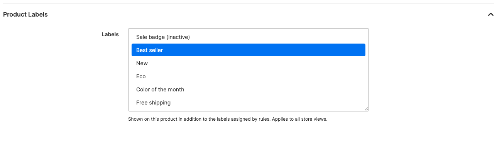

## Configurable products

A configurable product and each of its variants are separate products, and each can match a label on its own.

**Use for Parent.** When a variant matches a label with this option on, its configurable product gets the label
too.

**Following the variant.** On the product page, and in listings that show swatches, the badges change with the
customer's choice. While the selection is incomplete, the badges of the configurable product are shown. Once every
option is chosen, the badges of that variant replace them, and a variant without labels shows none. Below, the
hoodie itself has the "Eco" label, its black variants have "Color of the month" and the gray ones have no label.

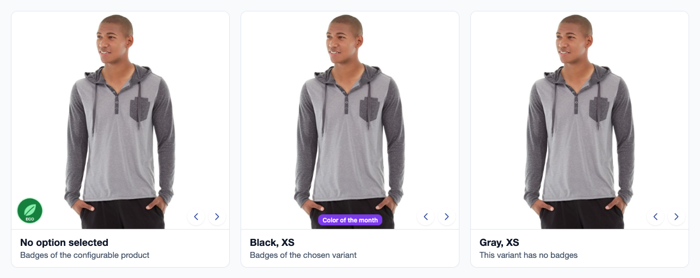

## On the storefront

| Place | Where the badges go |
| --- | --- |
| Product page | Over the main image, through Hyvä's `gallery.additional` container. |
| Category, search, widgets, related products | Over the image of each product card. A plugin wraps the card image; Hyvä's `item.phtml` is not copied. |
| Shopping cart page | Over the item thumbnail, the same way. |
| Mini-cart | Over the item image of the cart drawer. Hyvä has no slot there, so the module ships a copy of `Magento_Theme::html/cart/cart-drawer.phtml` with the badges added (search for `Majistar_ProductLabels` in the file). |
| Checkout | In the order summary of checkouts that dispatch the `majistar_checkout_summary_item` event (Majistar_Checkout). Hyvä Checkout and the Luma checkout are not supported yet. |

<p>
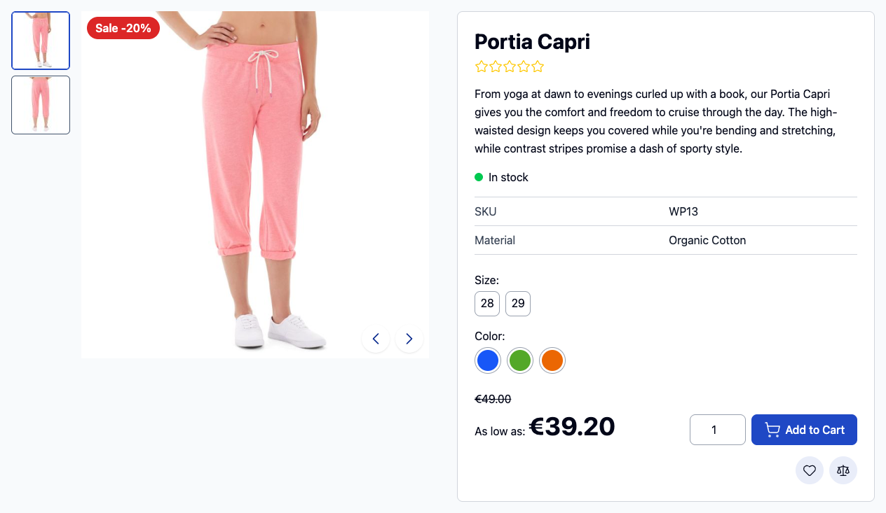
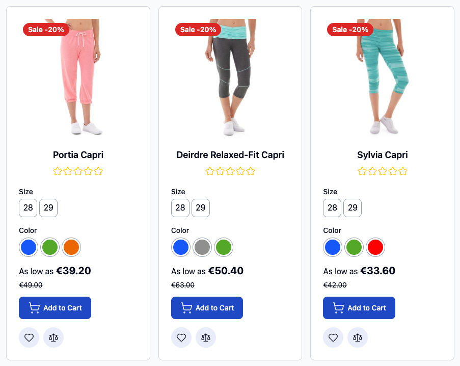
</p>

<p>
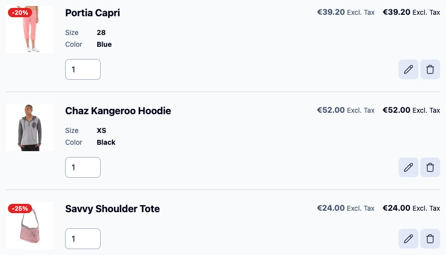
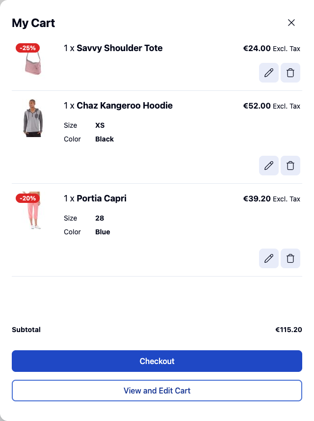
</p>

## Indexing and caching

Which products match which label is kept in the `majistar_product_labels` index. It follows label, product,
category and manual assignment changes on save ("Update on Save") or by cron ("Update by Schedule"). A full rebuild:

```bash
bin/magento indexer:reindex majistar_product_labels
```

Moving a category, changing its "Anchor" setting or adding a store view marks the index as invalid; reindex
afterwards (cron does it in "Update by Schedule" mode).

Prices, discounts, stock, "new" dates and the customer group are checked when the page is rendered and need no
reindex. Pages carry the `majistar_product_label` cache tag, so saving or deleting a label refreshes the full page
cache and the cached product cards. Changes that only depend on time, such as an "active to" date passing, appear
when the cached page expires.

## REST API

All routes require the ACL resource `Majistar_ProductLabels::labels`.

| Method | Route | Does |
| --- | --- | --- |
| `GET` | `/V1/majistar-product-labels/:labelId` | Returns a label. |
| `GET` | `/V1/majistar-product-labels/search?searchCriteria[...]` | Searches labels. |
| `POST` | `/V1/majistar-product-labels` | Creates a label. |
| `PUT` | `/V1/majistar-product-labels/:labelId` | Updates a label; only the fields you send change. |
| `DELETE` | `/V1/majistar-product-labels/:labelId` | Deletes a label. |
| `GET` | `/V1/majistar-product-labels/products/:productId` | Ids of the labels assigned to a product by hand. |
| `PUT` | `/V1/majistar-product-labels/products` | Replaces them: `{"productId": 10, "labelIds": [3, 5]}`. |

Creating a label that shows the discount on every product on sale:

```json
POST /rest/V1/majistar-product-labels
{
  "label": {
    "name": "Sale",
    "is_active": true,
    "priority": 10,
    "show_on": ["product", "listing", "cart", "minicart", "checkout"],
    "store_ids": [0],
    "customer_group_ids": [0, 1, 2, 3],
    "is_on_sale": true,
    "product_appearance": {
      "type": "text",
      "text": "Sale -{SAVE_PERCENT}%",
      "background_color": "#dc2626",
      "text_color": "#ffffff",
      "shape": "pill",
      "text_size": "m",
      "position": "top-left"
    }
  }
}
```

Leave out `listing_appearance` or `cart_appearance` to reuse the previous appearance. Accepted values: `show_on`
`product` `listing` `cart` `minicart` `checkout`; `shape` `rectangle` `pill` `circle`; `text_size` `s` `m` `l`;
`position` `top-left` `top-center` `top-right` `middle-left` `center` `middle-right` `bottom-left` `bottom-center`
`bottom-right`; `stock_status` `any` `in_stock` `out_of_stock` `low_stock`; `corner_radius` 0-50.
`conditions_serialized` takes the JSON of Catalog Price Rule conditions.

**Images.** Send the file as base64 in `image_content`. It must be a JPG, PNG, GIF, WebP or AVIF image of at most
2 MB; it is stored in `pub/media/majistar_product_labels/` and its name is returned in `image`. To reuse an image
that is already there, send its name in `image`.

```json
"product_appearance": {
  "type": "image",
  "image_content": {
    "base64_encoded_data": "iVBORw0KGgoAAAANSUhEUgAA...",
    "type": "image/png",
    "name": "best-seller.png"
  },
  "image_alt": "Best seller",
  "width_percent": 20,
  "position": "top-right"
}
```

**Products.** `GET /V1/products/:sku` and the product search return the labels assigned by hand in
`extension_attributes.majistar_product_labels`. Saving a product with that field replaces them; without it they are
left alone.

**Bulk.** Every route is also available through Magento's `/async/V1/...` and `/async/bulk/V1/...` endpoints, for
example `POST /rest/async/bulk/V1/majistar-product-labels` with an array of `{"label": {...}}`. The
`async.operations.all` consumer processes the requests, and `GET /V1/bulk/:bulkUuid/status` reports the result.

## Extending

Everything can be changed from another module, without editing this one.

- **Markup.** All badges come from one template, `Majistar_ProductLabels::badges.phtml`. Override it in your theme
  as `app/design/frontend/<Vendor>/<theme>/Majistar_ProductLabels/templates/badges.phtml`.
- **Badges in your own templates**, for example a custom product slider. Put them inside a `relative` element
  around the image:

  ```php
  <div class="relative">
      
      <?= /* @noEscape */ $viewModels->require(\Majistar\ProductLabels\ViewModel\Badges::class)
          ->renderBadges($product, 'listing') ?>
  </div>
  ```

  The second argument is the place: `product`, `listing`, `cart`, `minicart` or `checkout`.
- **Labels without the templates.** `Majistar\ProductLabels\Api\LabelResolverInterface::resolve($products, $area)`
  returns the labels of a list of products, ready to draw (text, image URL, colors, position). Use it for GraphQL,
  a PWA, emails or feeds.
- **Changing which labels are shown.** Add an `afterResolve` plugin on `LabelResolverInterface` to add, remove or
  reorder labels, or replace the resolver with a `preference` in `di.xml`.
- **Styling.** The Tailwind classes and inline styles come from public methods of the `Badges` view model
  (`getContainerClasses()`, `getTextClasses()`, `getStyle()`), so a plugin can change them.
- **Placement.** The badges are layout blocks and arguments: remove or move `majistar.product.labels.gallery` on
  the product page, or set the `majistar_product_labels_area` argument of `product_list_item` to an empty string to
  turn them off in listings.
- **Data.** Labels and manual assignments are available through `LabelRepositoryInterface` and
  `ProductLabelAssignmentInterface`. Saving a label dispatches the usual model events with the
  `majistar_product_label` prefix (`majistar_product_label_save_after`, `..._delete_after`), and a change of manual
  assignments dispatches `majistar_product_labels_assignment_save_after` with `product_id` and `label_ids`.
- **Conditions.** Any product attribute with "Use for Promo Rule Conditions" set to Yes can be used in Advanced
  Conditions.

## Development

The repository ships the coding standard (`phpcs.xml.dist`) and the unit test configuration (`phpunit.xml.dist`).
Run them from the module directory with the tools of a Magento or Mage-OS installation:

```bash
export MAGENTO_ROOT=/path/to/magento
$MAGENTO_ROOT/vendor/bin/phpcs
$MAGENTO_ROOT/vendor/bin/phpunit -c phpunit.xml.dist
```

`phpcs` uses the Magento coding standard (`magento/magento-coding-standard`, part of Magento's dev dependencies);
the unit tests use Magento's unit test framework found in `MAGENTO_ROOT`.

## Uninstalling

```bash
bin/magento module:disable Majistar_ProductLabels
composer remove majistar/module-product-labels
bin/magento setup:upgrade
```

The data stays in the database. To remove it, drop the `majistar_product_label*` tables and the indexer changelog
table `majistar_product_labels_cl`, and delete `pub/media/majistar_product_labels/`.

## License

Copyright © 2026 Majistar. Licensed under the [Open Software License 3.0](LICENSE) (OSL-3.0), the same license
as Magento Open Source and Mage-OS. See [COPYING.txt](COPYING.txt).

### Third-party code

`view/frontend/templates/cart/cart-drawer.phtml` is a modified copy of the cart drawer template of the
[Hyvä default theme](https://www.hyva.io) (`Magento_Theme::html/cart/cart-drawer.phtml`, version 1.5.2),
copyright © Hyvä Themes, which Hyvä Themes distributes under both the OSL 3.0 and the AFL 3.0; it is used here
under the OSL 3.0. The changes add the product badges to each cart item.
